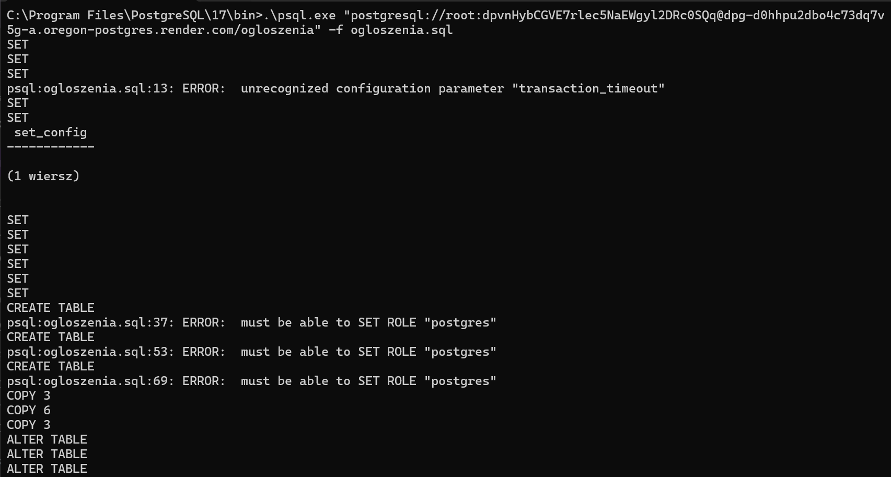
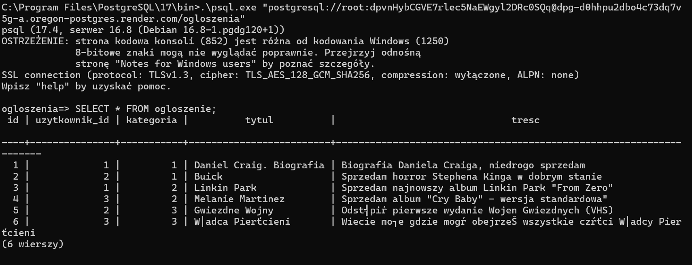
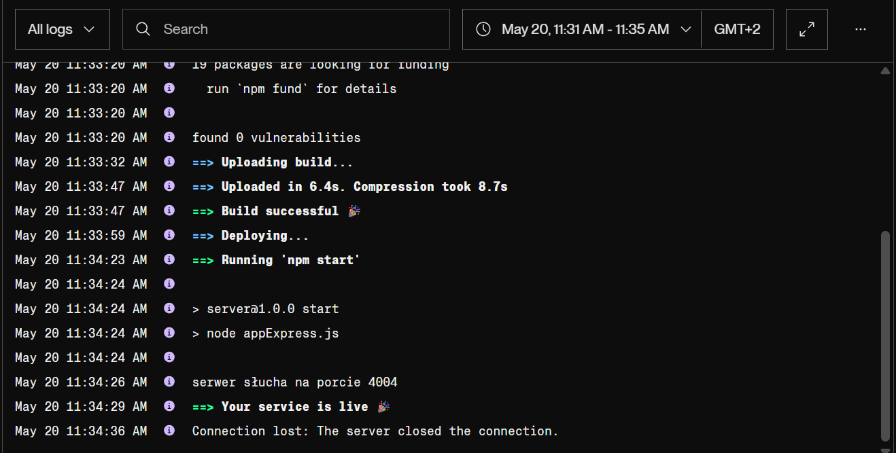
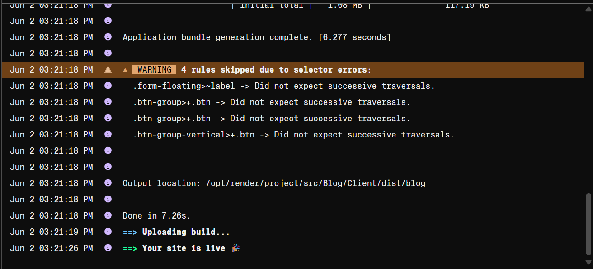

# Link do działającej aplikacji:

https://isi-aplikacja-blog-1.onrender.com/

# Zdjęcia do wybranych elementów:
Stawianie bazy danych:

Sprawdzenie bazy danych:

Postawienie serwera:

Postawienie-strony:

Działająca aplikacja:

